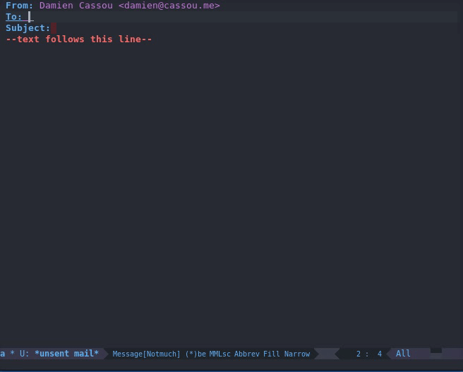

# vdirel

## Summary

[vdir](https://vdirsyncer.readthedocs.org/en/stable/vdir.html) is a standard for storing calendars and contacts on a file system much like maildir is for emails. `vdirel` provides utility functions to manipulate vdir repositories from Emacs.

## Installing

Use [melpa](http://melpa.org/) and `M-x package-install`.

## Using

First, you must configure variable `vdirel-repository` to your vdir
repository.

### Inserting Email addresses

This shows how to insert a comma-separated list of email addresses and
contact fullnames from your contact book.

Step by step:

1. `M-x vdirel-helm-select-email` to start the selection process
2. Type some letters to select a contact email address
3. Select the email address with `M-SPC` (in the mode-line, the `M<x>`
   counter increases to confirm the selection)
4. While you want to insert more email addresses, erase the minibuffer
   and go back to step 2
5. When you are done, press `RET` to insert all selected email
   addresses and associated fullnames in a comma-separated list

## Contributing

Yes, please do! See [CONTRIBUTING][] for guidelines.

## License

See [COPYING][]. Copyright (c) 2015 Damien Cassou.

[CONTRIBUTING]: ./CONTRIBUTING.md
[COPYING]: ./COPYING

<!--  LocalWords:  minibuffer fullnames modeline
 -->
